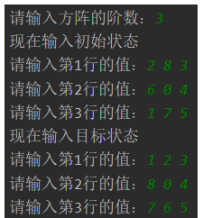
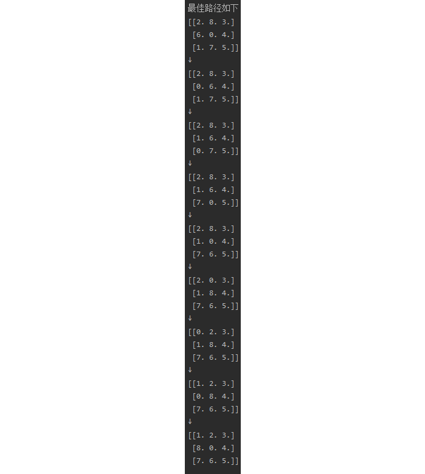
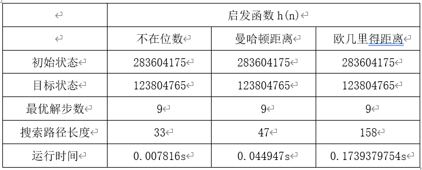

# Solve N Puzzle Problem with A\* Search（A\*搜索解决八数码问题）


The aim of this code is to solve N puzzle problem with A\* search. If you don't know what is A\* search, you can take a look on this [link](https://blog.csdn.net/weixin_58399148/article/details/121347500).

## Explanation of my code
To search, you need to load information of nodes first. The information to be stored in the node includes the digital location information state in the current graph, the cost to reach the node g (n), the heuristic function h (n), and the corresponding parent node for the convenience of subsequent backtracking. The class of node is as below.
```python3
# 结点的状态
class State:
    def __init__(self, state, g, h, parent):
        self.state = state  # 节点对应的状态矩阵
        self.g = g  # g(n)
        self.h = h  # h(n)
        self.f = g + h  # f(n)=g(n)+h(n)
        self.parent = parent  # 节点的父亲节点
```
Next, you need to read in the initial state and the target state. The method adopted here is to use the built-in input function of python to read in, and then convert the read in data into a numpy array.
```
# 输入初始状态与目标状态
def inputstate():
    num_amount = int(input("请输入方阵的阶数："))
    print("现在输入初始状态")
    start_state = np.zeros((num_amount, num_amount))
    end_state = np.zeros((num_amount, num_amount))
    for i in range(num_amount):
        temp_list = list(input("请输入第%d行的值：" % (i+1)).split())
        temp = np.asarray(temp_list)
        for j in range(num_amount):
            start_state[i][j] = temp[j]

    print("现在输入目标状态")
    for i in range(num_amount):
        temp_list = list(input("请输入第%d行的值：" % (i + 1)).split())
        temp = np.asarray(temp_list)
        for j in range(num_amount):
            end_state[i][j] = temp[j]
    print('--'*20)
    return start_state, end_state
```
To solve the N digit problem, the solvability of the problem must be analyzed first. According to the data, I learned that if the order of the square matrix is N, then when N is an odd number, the reverse order numbers of the initial and final states have the same parity, so they can reach each other; When N is an even number, the parity of the absolute value of the difference between the reverse number of the initial and final states and the absolute value of the difference between the number of rows of the null value of the initial and final states is the same, so they can reach each other. 
```
# 逆序数判断是否有解
def have_solution(start_state, end_state):
    start_state_num = 0  # initial逆序数
    end_state_num = 0  # goal逆序数
    sign = 0
    if start_state.shape[0] % 2 != 0:
        sign = 1
    start_state = start_state.reshape(1, start_state.shape[0]*start_state.shape[1]).squeeze()
    end_state = end_state.reshape(1, end_state.shape[0]*end_state.shape[1]).squeeze()
    for i in range(start_state.shape[0]):  # 计算initial逆序数
        temp = 0
        for j in range(i):
            if start_state[j] > start_state[i] != '0':
                temp = temp + 1
        start_state_num += temp

    for i in range(end_state.shape[0]):  # 计算goal逆序数
        temp = 0
        for j in range(0, i):
            if end_state[j] > end_state[i] != '0':
                temp = temp + 1
        end_state_num += temp

    # N为奇数时逆序数奇偶同性可互达
    # N为偶数时，两状态逆序数之差sum与两状态空格所在行行距奇偶性相同可互达
    if sign == 1:
        if (start_state_num % 2) != (end_state_num % 2):
            print("此情况无解")
            return False
        else:
            print("此情况有解")
            return True
    else:
        a = abs(start_state_num - end_state_num)
        b = abs(np.array(np.where(start_state == 0))[0] - np.array(np.where(end_state == 0))[0] - 1)
        if a % 2 == b % 2:
            print("此情况有解")
            return True
        else:
            print("此情况无解")
            return False
```
In this code, I designed three heuristic functions: Not in Digits, Manhattan Distance, and Euclid Distance, as shown in Figure 5. The number of digits not in the position refers to the number of digits not in the corresponding position among N digits in the initial and final status. The other two heuristic functions add up the distance between each digit in the initial and final states, and divide it into Manhattan distance and Euclid distance according to the measurement of distance. The Manhattan distance refers to the sum of the absolute values of the difference between the horizontal and vertical coordinates, while the Euclid distance refers to the distance between the two in the two-dimensional plane. Combined with the movement rules of the N digital problem, I think Manhattan distance is more consistent with the actual rules of the N digital problem, so the effect should be better.
```
# 启发函数
def h(present, goal, choose):
    a = 0
    if choose == 1:
        # choose等于一，用不在位数
        for i in range(len(present)):
            for j in range(len(present[i])):
                if present[i][j] != goal[i][j] and present[i][j] != 0 and goal[i][j] != 0:
                    a += 1
    elif choose == 2:
        # choose等于二，用不在位距离和，距离用曼哈顿距离度量
        for i in range(len(present)):
            for j in range(len(present[i])):
                loc1 = np.array(np.where(present == present[i][j])).squeeze()
                loc2 = np.array(np.where(goal == present[i][j])).squeeze()
                a += abs(loc1[0] + loc2[0]) + abs(loc1[1] - loc2[1])
    elif choose == 3:
        # choose等于三，用不在位距离和，距离用欧几里得距离度量
        for i in range(len(present)):
            for j in range(len(present[i])):
                loc1 = np.array(np.where(present == present[i][j])).squeeze()
                loc2 = np.array(np.where(goal == present[i][j])).squeeze()
                a += math.sqrt((loc1[0] + loc2[0]) ^ 2 + (loc1[1] - loc2[1]) ^ 2)
    return a

```
Considering the space complexity, the code is implemented in a circular way instead of recursion. In the process of the algorithm, I also performed some pruning operations. The specific algorithm implementation ideas are as follows. First, store the initial status in the list, and then pop up the initial status to load the child nodes. The calculation method of sub nodes is: first, check the position of 0, and then check the elements that can be moved when there are several elements in the top, bottom, left and right of 0. The new state after moving can form a new sub node. Load the formed sub nodes into the list again. When loading the list, prune them according to whether the list has this status, and then sort the nodes in the list according to the evaluation function. Then pop up the first element in the list, and so on, until the pop-up element is consistent with the target state, then terminate the loop. The code is as follows:
```
# A*算法
def a_star(start, end_state):
    print("启发函数：")
    print("1、不在位数")
    print("2、曼哈顿距离")
    print("3、欧氏距离")
    choose = int(input("请选择输入对应序号选择启发函数："))
    start_state = State(state=start, g=0, h=h(start, end_state, choose), parent=None)  # 初始状态
    open = [start_state]
    close = []
    num = 0
    start_time = time.time()

    while len(open) > 0:  # open表是否为空表
        open_1 = [i.state for i in open]  # 访问open节点内的state
        close_1 = [i.state for i in close]

        n = open.pop(0)  # 删除open队头节点（此点排序后为最小距离和），并且赋值给n
        close.append(n)  # n加入close表

        if (n.state == end_state).all():
            result_list = [n.state]
            result_list = best_path(n, result_list)
            print('\n最佳路径如下')
            for i in range(len(result_list)):
                if i == 0:
                    print(result_list[len(result_list) - i - 1])
                else:
                    print('↓')
                    print(result_list[len(result_list) - i - 1])
            break
        else:
            # 获取一层子节点，即交换0与相邻元素后可以获得的结点
            children = []
            elements_changable = []

            # 找到0的位置
            zero_position = np.array(np.where(n.state == 0)).squeeze()

            # 获取可与0交换的元素
            if zero_position[0] > 0:
                elements_changable.append([zero_position[0] - 1, zero_position[1]])  # 上边的数
            if zero_position[0] < n.state.shape[0]-1:
                elements_changable.append([zero_position[0] + 1, zero_position[1]])  # 下边的数
            if zero_position[1] > 0:
                elements_changable.append([zero_position[0], zero_position[1] - 1])  # 左边的数
            if zero_position[1] < n.state.shape[1]-1:
                elements_changable.append([zero_position[0], zero_position[1] + 1])  # 右边的数

            for i in elements_changable:
                # 逐个元素与0交换位置,生成子节点child
                new_state = copy.deepcopy(n.state)
                new_state[i[0], i[1]], new_state[zero_position[0], zero_position[1]] = new_state[zero_position[0], zero_position[1]], new_state[i[0], i[1]]
                child = State(state=new_state, g=n.g+1, h=h(new_state, end_state, choose), parent=n)
                # 将每一个交换结果（子节点）都存入children
                children.append(child)

            for i in children:  # 添加子节点进open
                if not any((i.state == x).all() for x in open_1):
                    if not any((i.state == x).all() for x in close_1):
                        open.append(i)
                        open.sort(key=lambda m: m.f)  # 按f(n)进行排序
            print("\r求求了，不要催，在算了，已经进行{}步，耗时{}秒".format(num, time.time()-start_time), end='')
            num += 1

    print('\n'+'--' * 20)
    search_line(close)
    print('搜索步骤为', len(close) - 1, '总估价为', close[-1].f)

```
Since the parent node of each node is saved, recursion is used for output.
```
# 打印最短路径
def best_path(n, result_list):
    if n.parent is not None:
        result_list.append(n.parent.state)
        result_list = best_path(n.parent, result_list)
    return result_list


# 输出搜索路径：
def search_line(close):
    print('搜索路径如下：')
    for i in close[:-1]:
        print(np.array(i.state))
        print('↓')
    print(np.array(close[-1].state))
```
## Result
The input is as below:



The result is as below:



And we can compare the three h(n):



According to the actual situation, out of digits is the most efficient heuristic function with the shortest steps, while Manhattan distance is slightly inferior to out of digits, and Euclid distance is significantly inferior to the former two.
